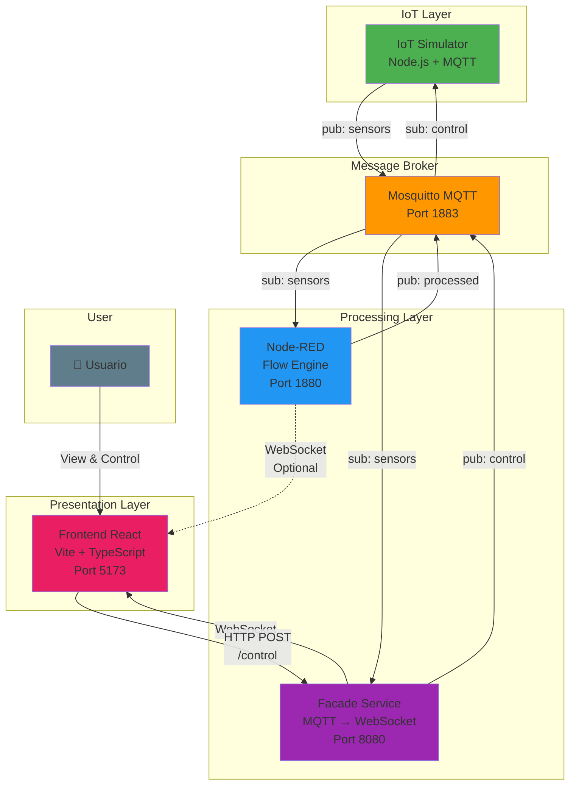
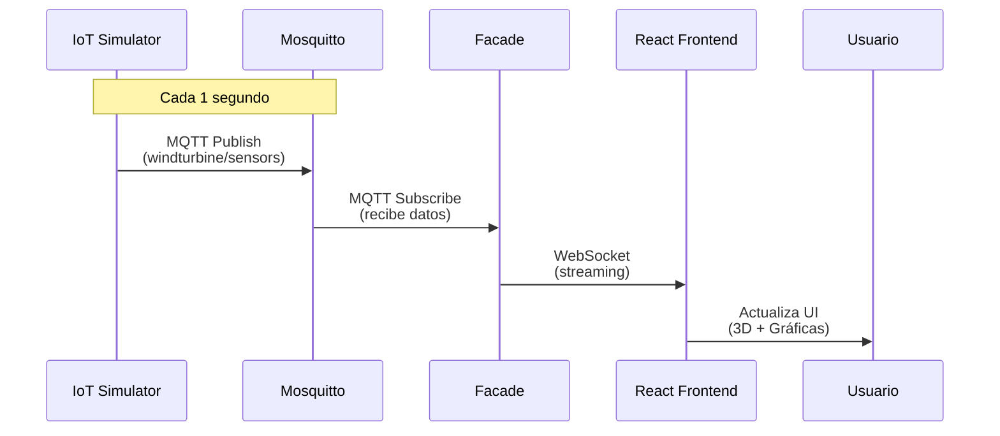
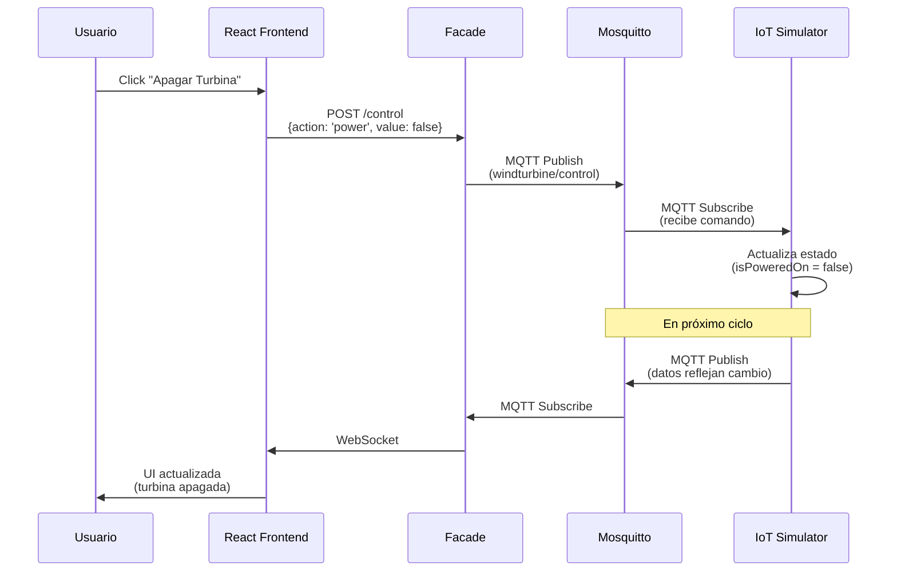
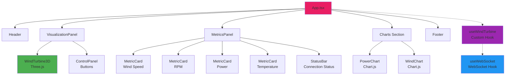
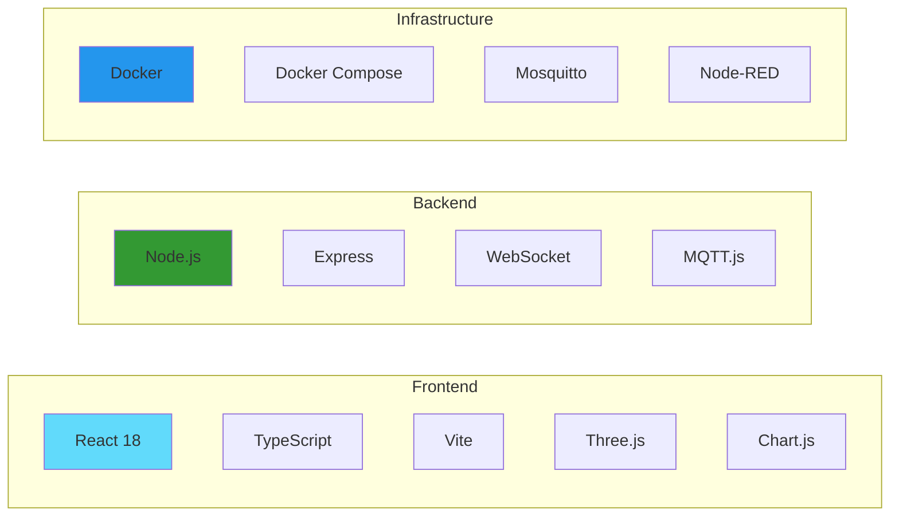
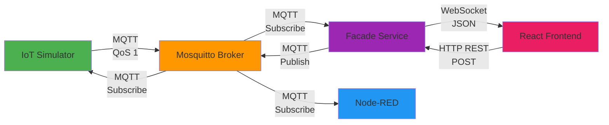
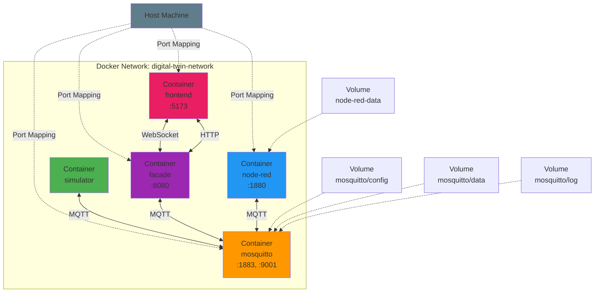

# 📊 Diagrama de Arquitectura - Digital Twin

## Arquitectura Completa del Sistema

## Flujo de Datos Principal

## Flujo de Control Bidireccional

## Arquitectura de Componentes Frontend

## Stack Tecnológico por Capa

## Protocolo de Comunicación

## Despliegue Docker

---

## 📝 Leyenda de Colores

- 🟢 **Verde**: IoT Simulator / Data Generation
- 🟠 **Naranja**: MQTT Broker / Message Bus
- 🔵 **Azul**: Node-RED / Processing
- 🟣 **Púrpura**: Facade / Backend Bridge
- 🔴 **Rojo/Rosa**: Frontend / User Interface
- ⚫ **Gris**: Usuario / External

---

## 🔗 Referencias

- [ARCHITECTURE.md](./ARCHITECTURE.md) - Documentación detallada
- [QUICKSTART.md](./QUICKSTART.md) - Guía de inicio rápido
- [README.md](./README.md) - Información general
